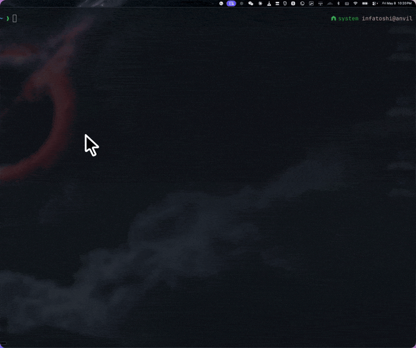

# τ


minimal rust coding-agent harness

## install

```sh
cargo run --bin tau-install
```



1. the first `tau` run creates `~/.tau/config.yaml`

2. api keys go in a project `.env`, or `~/.tau/.env`.

3. harness reads `AGENTS.md`

4. dev/testing workflow is `cargo fmt --check && cargo test && cargo clippy --all-targets --all-features -- -D warnings`
